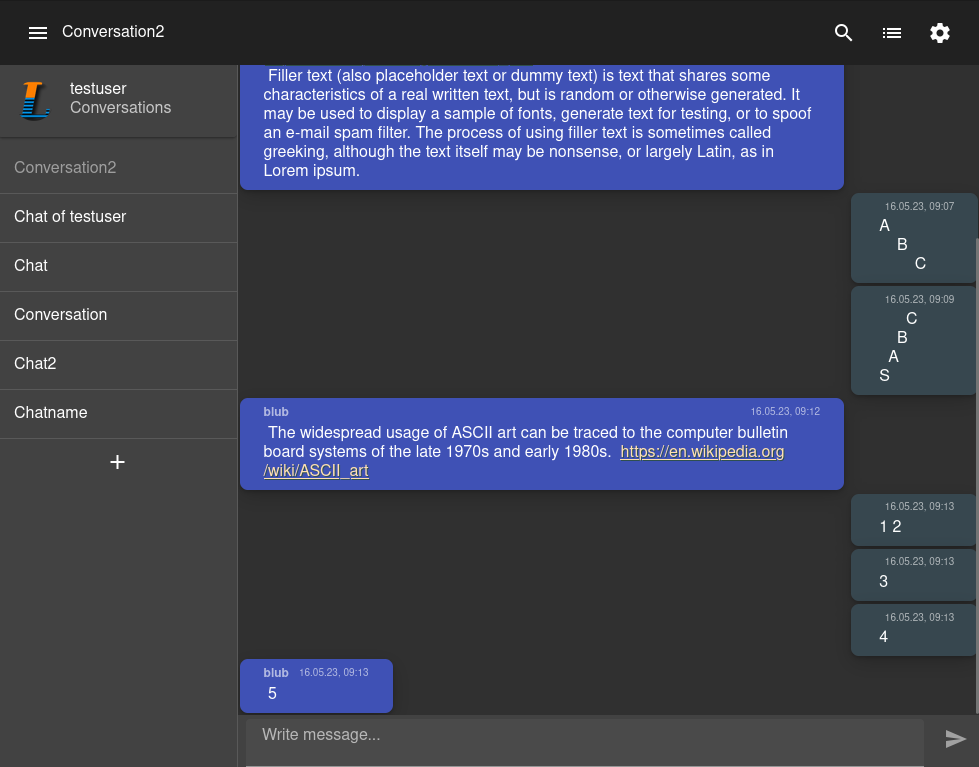

# Local Chat
Simple local network client-server chatting web app with Spring Boot and Angular.


Note that this app is intended as a learning aid and personal reference. **Unsafe for production** due to custom authentication logic.
## Stack

- Backend
  - Spring Boot 
  - PostgreSQL (with Flyway migrations)
  - Swagger codegen (openapi)
  - WebSockets
  - Unit tests (SpringBoot, MockK)
- Frontend
  - Angular 16 ( + Material Design )
  - NgRx store ( + router-store)
  - Audio worklets + WebSockets (for basic voice transmission)
  - Karma tests
- Deployment with Docker/Podman
  - Build with _gradle_ and run on _openjdk:17-jdk-alpine_ image
  - *Dev* and *prod* configurations for _docker-compose.yaml_

## Features

- User authentication
  - Register/login/logout and view/delete active login cookies
- Conversation
  - Users may create a new conversation and add/remove members
  - Desktop notifications (informed by Server-sent events (SSE))
  - Infinite scroll for older messages
  - Edit member permissions (and color)
  - Text/Regex search with message highlighting
  - Experimental voice transmission (without WebRTC) via WebSockets + AudioWorklet

## Development
Generate a key store for the `dev` profile:
```shell
./gen-keystore.sh dev
```
Run the backend api at `localhost:9432` without assembling the webclient:
```shell
docker-compose up -d db pgadmin
POSTGRES_HOST=localhost ./gradlew server:bootRun -x :server:webclient:assembleFrontend
```
Then, run the webclient in `development` configuration at `localhost:4200`:
```shell
cd server/src/webclient && yarn install
yarn start
```

## Deployment
Generate a key store for the `prod` profile:
```shell
./gen-keystore.sh prod
```
Then, configure `docker-compose.prod.yaml` and startup an instance:
```shell
./gradlew build
docker-compose up -f docker-compose.yaml -f docker-compose.prod.yaml -d
```
Note that by default `server.ssl.enabled: false` and some existing reverse proxy configuration is expected for SSL.
